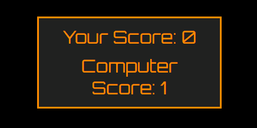
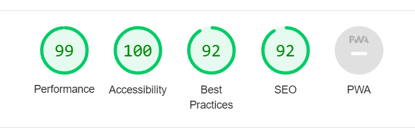

# Rock, Paper, Scissors

My webpage is a classic game of "Rock, Paper, Scissors" that utilises Javascript to provide a fun interactive game where the user can play against the computer in a first to five format to decide the Champion. 

# Features
---
# Header

-Title of the Webpage Rock, Paper, Scissors in Large easy to read 'Orbitron' font.

# Game area:

## Choose Section:

- Text stating "Choose" displays to the user that they should choose (click) on one of the images placed below to start the game.

- Three divs are displayed with images of Rock Paper and scissors that zoom in when hovered over. These activate when clicked using the event listener(click) function and are used as the user's 'pick' during the game.

### First to Five:

- A small area of text to state that the first player to reach a score of five is the winner, This informative text leaves when the game is started and is brought at the start of a new game.

### You Picked area:

- This is where both the user's choice and computers choice are displayed in text with the winner of the two displayed beneath. 

### The Score section:

- This is a score board where both the user's and the computer's scores are tallied throughout the game.

### Footer:

- The rules for the game are located in the footer of the page.

### Play again Section:

- After One player has reached a score of five An overall winner is declared and the option to reset the scores to zero and play again is offered. 
- 'Would you like to play again' is underlined and changes color when hovered over to display its action and encourage interactivity.

## Testing:

### Browsers:

- I have tested that this webpage works in Google Chrome, Firefox and Microsoft Edge and can confirm that this page works well across all of them. 

### Validators:

#### CSS:

- No errors were found:

#### Javascript:

-No errors were found:

#### HTML:

- No errors were found:

#### Lighthouse:

- In lighthouse my webpage performed well with a score of 100 in accesibility.

## Bugs:

- I have had a minor bug when running my webpage in firefox as the images do not zoom in when hovered over, I have tried changing the css styling from 'zoom' to Transform origin and while this has worked for firefox it has hindered ability in chrome and microsoft Edge, I have found no fix for this and have hence stuck with the zoom property as the webpage still works well. 

## Credits:

- I have used the 'Orbitron' from google fonts.

- I have used the random number function from The love maths project to generate a random computer prediction.

- I used a transform property to replace a zoom CSS function but have since taken it out as it did not have the desired effect.

## Deployment:

I have Deployed the Page in Github Pages.

The steps to deploy are:

-In the Github Repository navigate to the settings tab. 

-Scroll down to the pages section in the 'Code and automation section on the left hand side.

- Select branch: Main in source and save.

- The link for the functioning webpage can be found here: https://jdacky95.github.io/Rock-Paper-Scissors-/
